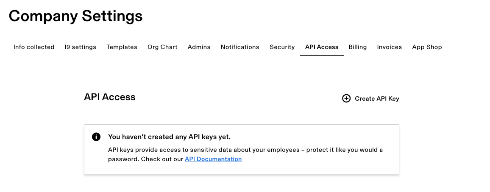

# Customers

Rippling customers access the Rippling API to retrieve and update information on their organization's behalf.

If you are a Rippling customer, you will need to create an API key with defined scopes in order to access the Rippling API.

Note, the API key will only be able to access data that you specifically enable it to during the API Key creation process. You will need to explicitly grant the API key access to data fields on behalf of your organization.

## Creating your API Key

To generate your Rippling API key, please follow these steps.

1. [Log in to Rippling as an admin for your organization](https://app.rippling.com/login)
2. Select **Company Settings**
3. [Navigate to **API Access**](https://app.rippling.com/company-settings/api-access)
4. Click **Create API Key**
5. Provide the scopes and description of your API key
6. Click **Save**

## Viewing your API keys

To view your Rippling API keys, please follow these steps.

1. [Log in to Rippling as an admin for your organization](https://app.rippling.com/login)
2. Select **Company Settings**
3. [Navigate to **API Access**](https://app.rippling.com/company-settings/api-access)

You will then be able to copy or delete your API keys as desired.

 

<iframe src="https://www.loom.com/embed/c4aada9958f94c35b793e181e38a2eef" frameborder="0" webkitallowfullscreen mozallowfullscreen allowfullscreen style="position: absolute; top: 0; left: 0; width: 100%; height: 100%;"></iframe>

